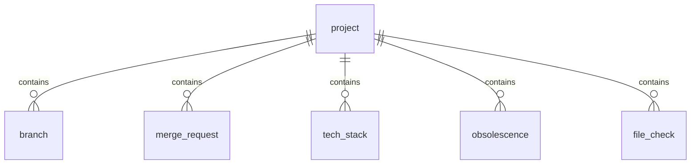

# Architecture Dashboard Radar

## Vue d'ensemble

Dashboard Radar est une application batch Spring Boot 3 destinée à être exécutée quotidiennement (CronJob OpenShift) pour auditer les dépôts GitHub d'une organisation. L'application consomme l'API GitHub, applique des règles internes (structure de projet, standards Git Flow, matrice d'obsolescence) puis persiste les résultats dans PostgreSQL.

## Modules

| Module | Description |
| ------ | ----------- |
| `GithubScannerService` | Collecte des métadonnées GitHub via `WebClient` (dépôts, branches, MR, langages, fichiers). |
| `MetadataAnalyzerService` | Associe chaque projet à une stack (Java Spring, Angular, ...) et vérifie la présence des dossiers/fichiers attendus. |
| `ComplianceCheckerService` | Contrôle le respect du Git Flow et des conventions de branches, détecte la présence d'une chaîne CI. |
| `ObsolescenceDetectorService` | Compare les versions détectées à la matrice d'obsolescence (YAML). |
| `PersistenceService` | Alimente le modèle relationnel (JPA/Hibernate) pour exploitation via l'application d'audit. |

## Flux batch

1. **Job `dashboardRadarJob`** (Spring Batch) : lancé au démarrage, exécute un `Tasklet` unique (`AuditTasklet`).
2. `AuditTasklet`
   - Récupère la liste des projets via `GithubScannerService`.
   - Enrichit chaque `ProjectSnapshot` avec les structures détectées.
   - Applique les contrôles (`ComplianceCheckerService`, `ObsolescenceDetectorService`).
   - Persiste les résultats (`PersistenceService`).
3. Les tables sont alimentées via Hibernate en `ddl-auto=update` (H2 en dev, PostgreSQL en cible).

## Schéma relationnel

### Tables

- `project (id, name, full_name, parent_group, is_archived, last_activity)`
- `branch (id, name, is_default, is_protected, last_commit_date, project_id)`
- `merge_request (id, title, author, reviewers, created_at, updated_at, state, project_id)`
- `tech_stack (id, language, framework, version, project_id)`
- `obsolescence (id, component, current_version, minimum_version, deprecated_before, end_of_support, severity, status, project_id)`
- `file_check (id, jenkins_ok, dockerfile_ok, has_ci_file, project_id)`

## Configuration externe

- **`dashboard.github`** : token et organisation GitHub, taille des pages API.
- **`dashboard.structure`** : règles par stack (chemins obligatoires, fichiers CI, frameworks autorisés/interdits, langages acceptés).
- **`dashboard.obsolescence`** : matrice d'obsolescence (version minimale, dates EOL, sévérité).

## Déploiement

- Image Docker Spring Boot (JDK 17) déployée sur OpenShift.
- CronJob OpenShift planifié (1 exécution/jour, créneau nocturne).
- Authentification GitHub par token personnel ou OAuth2 (scope `repo:read`).
- Stratégie de retry via Spring `WebClient` configurable (backoff via `retryWhen` si besoin).
